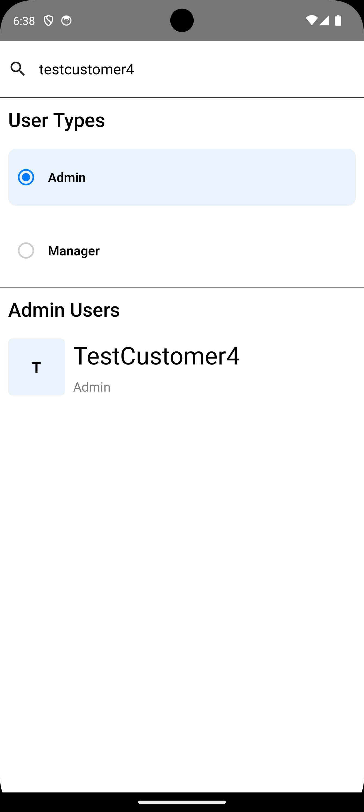
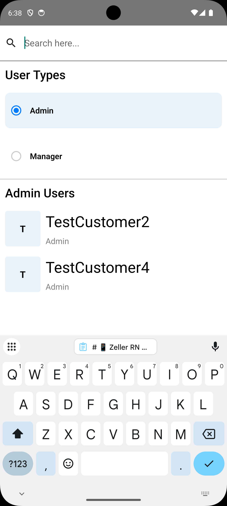
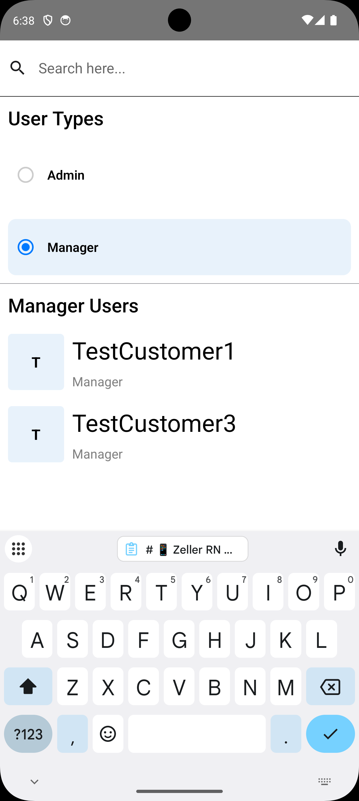
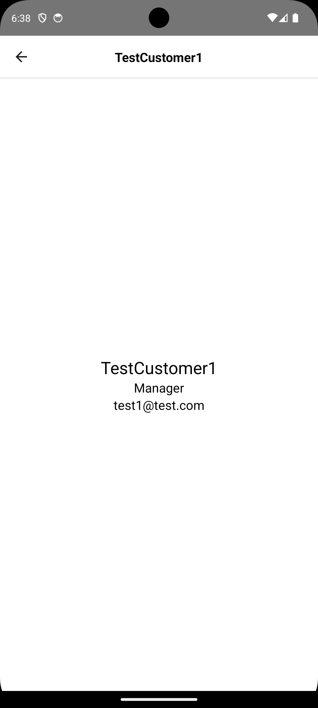
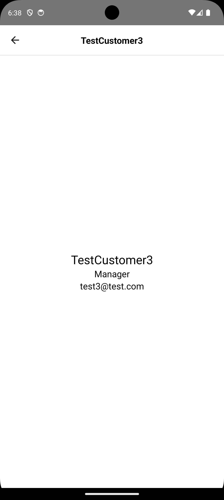

# 📱 Zeller RN Code Challenge

A React Native app to display and filter a list of users using GraphQL. This project was built as part of a coding interview assessment.

# ✨ Features

### 🔍 User Filtering

Filter users by roles (Admin, Manager) using a custom toggle.

### 🧑‍💻 GraphQL Integration

Connected to a GraphQL backend using Apollo Client with lazy queries and filters.

### 🔄 Search Support

Text search input with debounce to filter users by name.

### 🔃 Pull to Refresh

Manual refresh support for re-fetching the user list.

### ✅ Navigation

Stack navigation implemented using React Navigation (Home, Customer screens).

### 🧪 Test Coverage

Full test coverage using @testing-library/react-native and Jest.

# 🛠 Tech Stack

React Native

TypeScript

Apollo Client (GraphQL)

Jest + Testing Library

React Navigation

# 📷 UI Screenshots

<table>
  <tr>
    <td align="center">
      
    </td>
  </tr>
</table>

<table>
  <tr>
    <td align="center">
      
    </td>
    <td align="center">
      
    </td>
    <td align="center">
      
    </td>
  </tr>
  <tr>
    <td align="center">
      
    </td>
    <td align="center">
      
    </td>
    <td align="center">
      
    </td>
  </tr>
</table>

## Build and run your app

With Metro running, open a new terminal window/pane from the root of your React Native project, and use one of the following commands to build and run your Android or iOS app:

### Android

```sh
# Using npm
npm run android

# OR using Yarn
yarn android
```

### iOS

For iOS, remember to install CocoaPods dependencies (this only needs to be run on first clone or after updating native deps).

The first time you create a new project, run the Ruby bundler to install CocoaPods itself:

```sh
bundle install
```

Then, and every time you update your native dependencies, run:

```sh
bundle exec pod install
```

For more information, please visit [CocoaPods Getting Started guide](https://guides.cocoapods.org/using/getting-started.html).

```sh
# Using npm
npm run ios

# OR using Yarn
yarn ios
```

If everything is set up correctly, you should see your new app running in the Android Emulator, iOS Simulator, or your connected device.

This is one way to run your app — you can also build it directly from Android Studio or Xcode.
